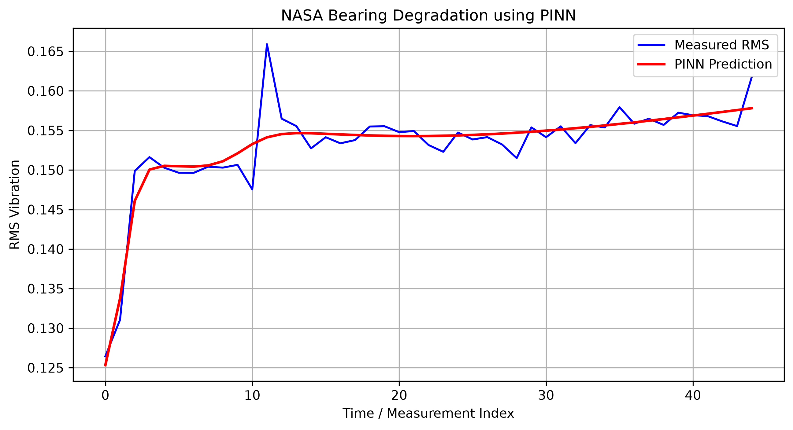

# NASA Bearing — Physics-Informed Neural Network

A short Physics-Informed Neural Network (PINN) project for bearing degradation analysis using the NASA IMS Bearing Dataset.

---

## Overview

This project uses vibration measurements from the NASA IMS Bearing Dataset to model bearing degradation over time.

The workflow is:

```text
NASA Bearing Data
       ↓
Vibration Signal
       ↓
RMS Feature
       ↓
Normalization
       ↓
PINN
       ↓
Data Loss + Physics Loss
       ↓
Degradation Prediction
       ↓
Visualization
```

---

## Dataset

**NASA IMS Bearing Dataset — Set 1**

The project currently uses:

```text
sample/1st_test/
```

The dataset contains vibration measurements collected during a run-to-failure experiment.

Each file represents a vibration measurement at a specific point in time.

---

## Project Structure

```text
PINN_NASA/
│
├── sample/
│   └── 1st_test/
│       ├── 2003.10.22.14.39.13
│       ├── 2003.10.23.08.04.13
│       └── ...
│
├── plots/
│   └── pinn_degradation.png
│
├── main.py
├── requirements.txt
├── README.md
├── LICENSE
└── .gitignore
```

---

## Method

### 1. Vibration Signal

The first vibration channel is loaded from each measurement file:

```python
signal = data[:, 0]
```

### 2. RMS Feature

RMS is calculated as a simple vibration-health indicator:

```text
RMS = sqrt(mean(signal²))
```

### 3. Normalization

Time and RMS values are normalized to improve neural-network training.

### 4. PINN Model

The neural network contains:

```text
Input: Time
   ↓
Linear(1 → 32)
   ↓
Tanh
   ↓
Linear(32 → 32)
   ↓
Tanh
   ↓
Linear(32 → 1)
   ↓
Predicted degradation
```

### 5. Physics-Informed Loss

The model uses two components:

```text
Total Loss
    =
Data Loss
    +
0.1 × Physics Loss
```

The physics constraint penalizes negative degradation rates:

```text
dy/dt < 0
```

This encourages the predicted degradation curve to be non-decreasing.

---

## Output

After training, the project generates:

```text
plots/pinn_degradation.png
```

The figure compares:

```text
Blue → Measured RMS
Red  → PINN Prediction
```

### Degradation Prediction



---

## Installation

Install the required dependencies:

```bash
pip install -r requirements.txt
```

### requirements.txt

```text
numpy
matplotlib
torch
```

---

## Run

From the project root:

```bash
python main.py
```

The training progress is printed every 500 epochs.

Example:

```text
Epoch    0 | Loss = ...
Epoch  500 | Loss = ...
Epoch 1000 | Loss = ...
...
Epoch 4500 | Loss = ...
```

---

## Training

Current configuration:

```text
Optimizer: Adam
Learning rate: 0.001
Epochs: 5000
Hidden layers: 2
Hidden units: 32
Activation: Tanh
Physics-loss weight: 0.1
```

---

## Visualization

The final degradation plot is saved automatically:

```text
plots/pinn_degradation.png
```

Conceptually:

```text
RMS
 ↑
 │                 ╱ PINN
 │              ╱
 │     ~~~~~~~~╱
 │  ~~~ Measured
 │
 └────────────────────→ Time
```

The generated figure is also included directly in this README:


---

## Limitations

This is a compact educational PINN implementation.

The current physics constraint assumes that the degradation indicator should generally increase with time. It does not yet use a detailed physical bearing-dynamics equation.

Future versions can introduce:

* Multiple vibration channels
* More vibration features
* Bearing-specific physics
* Anomaly detection
* Remaining Useful Life (RUL)
* Train/validation/test splitting
* Experiment tracking
* Model checkpoints
* Hyperparameter tuning
* Production inference

---

## Next Step

The next development step is to separate the current code into reusable components:

```text
Raw Data
    ↓
DataLoader
    ↓
Validation
    ↓
Feature Engineering
    ↓
PINN
    ↓
Evaluation
```

This will allow the project to grow without changing the core dataset.

---

## License

This project is licensed under the MIT License.

Copyright (c) 2026 N. Mousavi

See the [LICENSE](LICENSE) file for details.

---

## Author

**N. Mousavi**

Copyright (c) 2026 N. Mousavi

All rights reserved.
